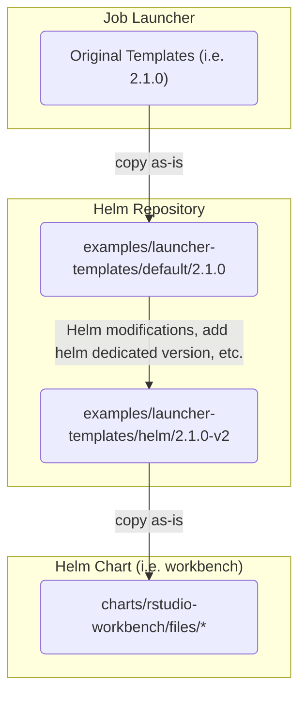

## Filing Bugs

If you're experiencing behavior that appears to be a bug in any of the Helm charts, you're welcome to [file an issue](https://github.com/rstudio/helm/issues/new). 

## Enhancements

You're also welcome to submit ideas for enhancements to our Helm charts. When doing so, please [search the issue list](https://github.com/rstudio/helm/issues) to see if the enhancement has already been filed. If it has, vote for it (add a reaction to it) and optionally add a comment with your perspective on the idea. 

## Contributing Code

We welcome contributions to our Helm charts! Before submitting your contribution, we ask that you ensure the change is helpful in a generic sense and is not tied to any specific organizational use-cases that would not be valuable to other organizations.

To submit a contribution:

1. [Fork](https://github.com/rstudio/helm/fork) the repository and make your changes.

2. Submit a [pull request](https://help.github.com/articles/using-pull-requests).

3. Sign the Contributor License Agreement via GitHub. A comment will be added to your pull request indicating if you need to sign the agreement and the link to do so.

We'll try to be as responsive as possible in reviewing and accepting pull requests. We highly appreciate your contributions!

## Assumptions / Common Dev Workflows

- Use `just docs` to generate the READMEs. READMEs are generated in CI by
  [Go templating](./charts/_templates.gotmpl) and `helm-docs`.
  - Run `just setup` to install `helm-doc`.
- CI requires that the chart version get bumped for any change in the directory.
- Use `just update-lock` to update all chart's lockfiles.
- Changes to the `rstudio-library` chart will update all downstream charts at
  the same time (via the `file://` syntax in `Chart.yaml`)
- CI only runs on local branches (i.e. not from forks). This can make
  evaluating code from contributors tricky. By creating a duplicate branch
  locally, we can "trick" CI into running on the same commits
  (including README)
- If `index.yaml` gets out of date on the repository, see
  [`./scripts/`](./scripts) for a workflow to fix

## Testing

Running the [helm chart unit tests](https://github.com/helm-unittest/helm-unittest):

```
# install the unittest plugin
helm plugin install https://github.com/helm-unittest/helm-unittest.git

# unit tests are defined in `charts/$CHART_NAME/tests`

# test all charts
just test

# run unit tests for a single chart
just test rstudio-connect
```

## Templates

The `rstudio-workbench` and `rstudio-connect` charts both make heavy use of the "templating" feature of the Posit Job
Launcher. The templates are embedded within the charts using the following paradigm:

- copy "parent" templates as-is into the [./examples/launcher-templates/default](./examples/launcher-templates/default)
  directory with a dedicated version folder. (i.e. `2.1.0`). NOTE that the "template version" is _not_ the "launcher version,"
  although a given Launcher version _only works_ with a single major version of the templates.
- Create a "helm-based" version (i.e. `v1`, `v2`, etc.) directory
  in [./examples/launcher-templates/helm](./examples/launcher-templates/helm). For example, `2.1.0-v2`.
    - Helm-based versions are simple integers with a `v` to delineate the difference
- Copy the templates from the "parent"/"default" directory to the new directory. Use `vimdiff` or some other diffing tool
  to make sure:
    - All helm-based features from the current helm-based version (i.e. `v2`) should be supported
    - All launcher-based features from the current launcher-based version (i.e. `2.1.0`) should be supported
    - The canonical way to do this is:
        - diff `helm/2.1.0-v2/job.tpl` against `default/2.1.0/job.tpl` (launcher version). You should see the helm modifications only
        - diff `helm/2.1.0-v2/job.tpl` against `helm/2-v2/job.tpl` (previous launcher+helm version)
          or `helm/2.1.0-v1/job.tpl` (previous helm version). You should see launcher changes or new helm features,
          respectively.
- Once the templates are stable, copy as-is to the chart `files/` directory (i.e. for `rstudio-workbench`,
  to [./charts/rstudio-workbench/files](./charts/rstudio-workbench/files)).
- Test using the [`launcher-template`](https://github.com/rstudio/launcher-template) utility (still under development).
```bash
helm template ./charts/rstudio-workbench | launcher-template
```

A diagram of the hierarchy / inheritance of templates is below:



> **IMPORTANT NOTE**: The template version is _tied to the product version_, and may differ between 
> products. Take care when updating a product's template versions, and ensure that you have tested
> with a proper license to ensure that the product is functional.

At some point, we plan to push some (all?) of the `helm`-based features upstream into the original. However, for now
we are evaluating and gathering feedback on the mechanism. In particular, we need to explore what "sub-templating" and
passing templated "values" look like inside of helm to simplify narrowly scoped logic injection by customers.

## Code of Conduct

As contributors and maintainers of this project, we pledge to respect all people who contribute through reporting issues, posting feature requests, updating documentation, submitting pull requests or patches, and other activities.

We are committed to making participation in this project a harassment-free experience for everyone, regardless of level of experience, gender, gender identity and expression, sexual orientation, disability, personal appearance, body size, race, ethnicity, age, or religion.

Examples of unacceptable behavior by participants include the use of sexual language or imagery, derogatory comments or personal attacks, trolling, public or private harassment, insults, or other unprofessional conduct.

Project maintainers have the right and responsibility to remove, edit, or reject comments, commits, code, wiki edits, issues, and other contributions that are not aligned to this Code of Conduct. Project maintainers who do not follow the Code of Conduct may be removed from the project team.

Instances of abusive, harassing, or otherwise unacceptable behavior may be reported by opening an issue or contacting one or more of the project maintainers.

This Code of Conduct is adapted from the Contributor Covenant, version 1.0.0, available at <https://www.contributor-covenant.org/version/1/0/0/code-of-conduct.html>.
