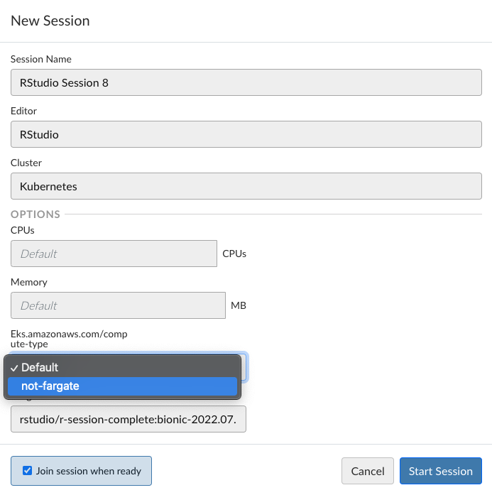

# Default Send Jobs to Fargate

These examples will send jobs to Fargate by default. This requires users to "opt out" of Fargate for job execution.

Let us presume that our Fargate profile requires the `fargate-job: true` label.

You must configure `launcher.kubernetes.profiles.conf` to make `not-fargate` an option:

_launcher.kubernetes.profiles.conf_
```ini
[*]
placement-constraints: eks.amazonaws.com/compute-type:not-fargate
```

This will be surfaced in the UI like:



Then the approach used is to:

- Change `service.type` to `ClusterIP` (required for Fargate)
- Add a `fargate-job: true` label by default
- Add a `eks.amazonaws.com/compute-type: fargate` placement constraint by default
  - This is potentially overkill, but ensures the job will be scheduled on fargate
- Remove standard `.Job.placementConstraint` injection by the job launcher (see NOTE below)
- When the `eks.amazonaws.com/compute-type` placement constraint equals `not-fargate`:
  - Remove the `eks.amazonaws.com/compute-type` placement constraint
  - Remove the `fargate-job: true` label

There are example templates here:

- [For v2](./2)

Please reach out to us if you have questions!

> NOTE: the current implementation has a few limitations:
> - Does not make any UI indications about resource constraints on Fargate
> - Does not allow any other usage of placement constraints. We use a "fake" placement constraint to indicate "not
    fargate", because the Launcher does not have a notion of "default placement constraints". To remedy this, you would
    need to "copy the `.Job.placementConstraints` list and remove the fake constraint."
> - Upgrading templates is your responsibility when changing the version of Workbench
