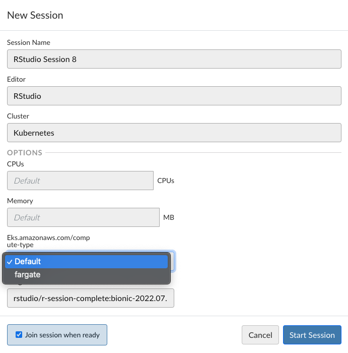

# Let Users Send Jobs to Fargate

These examples will send jobs to EKS nodes by default. This requires users to "opt into" Fargate for job execution by
choosing a placement constraint.

Let us presume that our Fargate profile requires the `fargate-job: true` label.

You must configure `launcher.kubernetes.profiles.conf` to make `fargate` an option:

_launcher.kubernetes.profiles.conf_
```ini
[*]
placement-constraints: eks.amazonaws.com/compute-type:fargate
```

This will be surfaced in the UI like:



Then the approach used is to:

- Change `service.type` to `ClusterIP` (required for Fargate)
- Add a `fargate-job: true` label when the `eks.amazonaws.com/compute-type` placement constraint equals `fargate`

There are example templates here:

- [For v2](./2)

Please reach out to us if you have questions!

> NOTE: the current implementation has a few limitations:
> - Does not make any UI indications about resource constraints on Fargate
> - Upgrading templates is your responsibility when changing the version of Workbench
